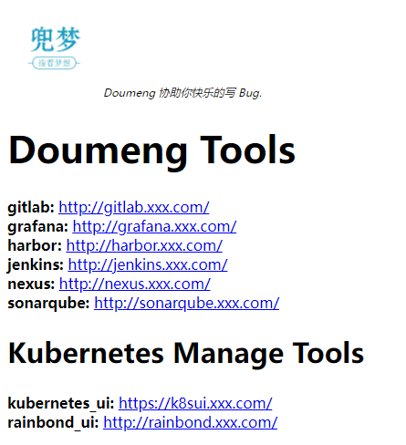

# AWS Operator
Infra AWS Operator. It manages and uses AWS API resources. It provides easy resource statistics while maintaining high performance of resource calls.

[中文](README-cn.md)

## goals and status
- The main goal of this operator is to：
```text
    1. Get aws service bill easily
    2. devops friendly (monitoring, availability, scalability and backups)
    3. Create and manage AWS Service resources
```

## Architecture design
- default URL path
```text
/check
    health status check
/-/reload
    reload config file
/metrics
/
    default page
/api/v1/
    BasicAuth page
```

## use it
- build package
```
# 执行 go build, 并制作 images
bash cmd/linux_build.sh v0.4
```

- kubernetes deploy
```
kubectl create namespace go
kubectl -n go create configmap go-default-service-configmap --from-file=configs/config.yaml
kubectl apply -f build/go_default_service-deploy.yaml
```

### demo
- initial page


